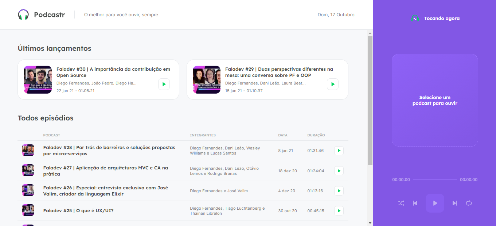

<h1 align="center">
   
  
   
</h1>

Uma plataforma construída para transmissão de podcast criada durante o NLW#5 da Rocketseat.

  

    

 

## :hammer: Tecnologias

Este projeto foi desenvolvido com as seguintes tecnologias:

- HTML5
- Sass
- React
- TypeScript

## 🚀 Execute o projeto

1. Clone este repositório `git clone https://github.com/dudunog/podcastr.git`
2. Entre no diretório do projeto `cd podcastr`
3. Instale as dependências com `yarn install` ou `npm install`
5. Inicie o projeto com `yarn run start` ou `npm run start`
